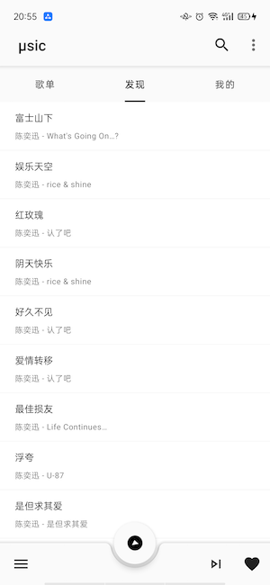

μsic
---

## 简介
一个Android音乐播放器，支持本地本地音乐，遵循Google原质化设计规范，封装了Android开发基本库，也可以基于此库，快速开发其他App。

## 命名由来
本意是找几个读音和 *music* 这个单词相近的中文汉字，没有找到，后面想到数学符号 *μ* ，于是便成了 *μsic*。

## 初衷
有次无意中看到德国博朗(Braun)公司的[文章](http://blog.presentandcorrect.com/rams-palettes)苹果第一代 *iPod* 时，将极致的简约美和舒适的用户体验感表现到极致，非常触动，于是想设计一款模仿 *iPod* 外观的音乐播放器，很可惜到目前很多功能还没有开发完毕,持续开发中。

)

## 使用到的技术
[retrofit](https://github.com/square/retrofit/)

[dagger2](https://github.com/google/dagger)

[rxjava2](https://github.com/ReactiveX/RxJava/)

[room](https://developer.android.google.cn/topic/libraries/architecture/room)

[viewmodel](https://developer.android.google.cn/topic/libraries/architecture/viewmodel)

[brvah](https://github.com/CymChad/BaseRecyclerViewAdapterHelper)

[permissionsdispatcher](https://github.com/hotchemi/PermissionsDispatcher)

[glide](https://github.com/bumptech/glide)

[ExoPlayer](https://github.com/google/ExoPlayer)

[uamp](https://github.com/android/uamp)

[...]()

## App截图

